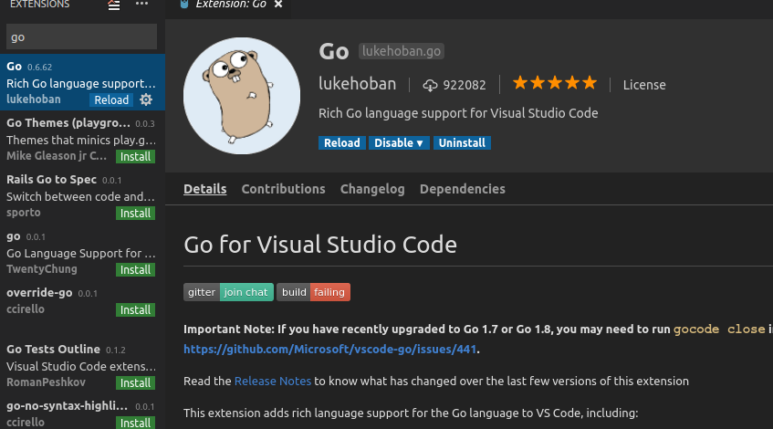
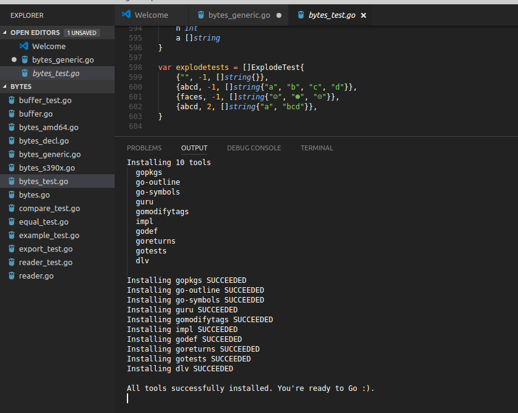
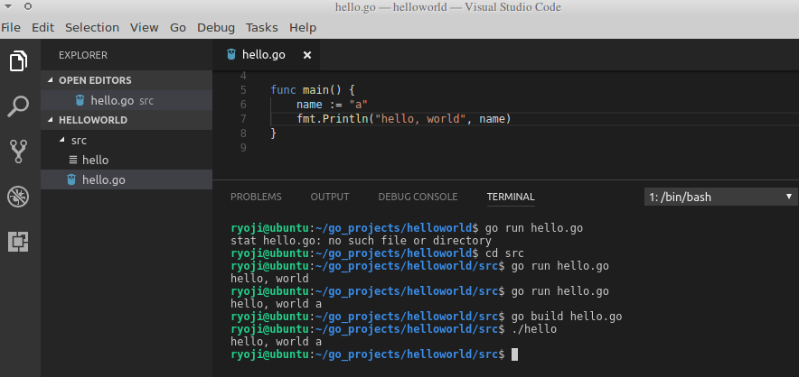

SET UP
======

```
wget https://golang.org/doc/install?download=go1.8.3.linux-amd64.tar.gz
tar xvf go1.8.3.linux-amd64.tar.gz -C ~
vim .profile
export PATH="$HOME/.cargo/bin:$PATH"
export GOROOT="$HOME/go"
export PATH="$HOME/go/bin:$PATH"
export GOARCH="amd64"
export GOHOSTARCH="amd64"
export GOPATH="$HOME/go-projects"
export GOTOOLDIR="$GOROOT/pkg/tool/linux_amd64"
export GOOS="linux"
```


`Ctrl Shift P` > type `install`



RUN
====
Ctrl `


